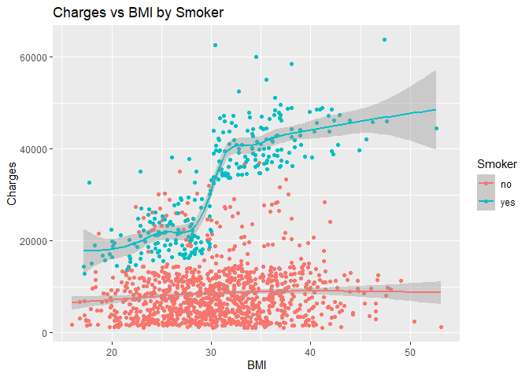

Health Insurance Cost Modeling
================

<center>

<subtitle>Kyle Offenloch</subtitle> <br> <subtitle>August 30,
2025</subtitle>
</center>

## Data used in this Project:

Health Insurance dataset from kaggle.com

<https://www.kaggle.com/datasets/willianoliveiragibin/healthcare-insurance>

Includes information on attributes of 1338 insured individuals,
including their age, sex, BMI, number of children, smoking habits, and
region. It also includes their medical costs incurred.

## Goal of this project:

- Analyze data to infer effects of other variables on medical costs.
- Create generalized linear models using different assumptions to
  predict costs.
- Test and compare models.

# General Analysis

First, we break down the data to look at the entire picture.

<!-- -->

These are the histograms, bar charts, and pie charts of each of the 7
attributes in this data set, helping us see the general frequency and
distributions of the variables.

Now we will plot medical charges against different attributes to deduce
the relationship, also including smoking status in each chart.

<!-- -->

Big difference in Charges by smoking status.

<!-- -->

Positive trend in charges with age, sizable difference between smoker
and non-smoker charges, with smoker charges having very high variance.

<!-- -->

Very little trend in charges with BMI for nonsmokers, large jump in
charges for smokers with BMI over 30.

<!-- --><!-- --><!-- -->

No trend in charges with no. of children, region or sex.

## Conclusion of attributes effects on charges

- Smoking has the largest effect on charges, showing up in every other
  chart when plotted with other attributes
- Age has a slight effect on charges the higher it is
- BMI has a quite large effect on charges in smokers, but not much for
  nonsmokers

# Building Models

We will build six different models, training them on 2/3 of the data,
then testing them on the other 1/3.

These will all be generalized linear models:

Model 1: Normal linear regression model with all six variables. This
model will include unrealistic negative cost predictions as a side
effect of assuming gaussian error terms and fully linear relationships
between variables.

``` r
model1<-lm(charges ~ age + sex + bmi + children + smoker + region, data = train_data)

predictions1 <- predict(model1,newdata=test_data)

test_data <- data.frame(test_data,Model1Prediction=predictions1)
```

Model 2: Normal linear regression model with only age, bmi, and smoker
status. This model will include unrealistic negative cost predictions as
a side effect of assuming gaussian error terms and fully linear
relationships between variables.

``` r
model2<-lm(charges ~ age + bmi + smoker, data = train_data)

predictions2 <- predict(model2,newdata=test_data)

test_data <- data.frame(test_data,Model2Prediction=predictions2)
```

Model 3: Gamma regression with all six variables. Using gamma regression
makes more sense for health costs due to right skewness and strict
positivity.

``` r
model3 <- glm(charges ~ age + sex + bmi + children + smoker + region, data=train_data, family=Gamma(link="log"))

predictions3 <- predict(model3, newdata=test_data, type="response")

test_data <- data.frame(test_data, Model3Prediction=predictions3)
```

Model 4: Gamma regression with only age, bmi, smoker status.

``` r
model4 <- glm(charges ~ age + bmi + smoker, data=train_data, family=Gamma(link="log"))

predictions4 <- predict(model4, newdata=test_data, type="response")

test_data <- data.frame(test_data, Model4Prediction=predictions4)
```

Model 5: Gamma regression with all 6 variables, including interactions
with smoker status, allowing smoking to have different effects on costs
when combined with other attributes.

``` r
model5 <- glm(charges ~ smoker * (age + bmi + children + region + sex),
                      data = train_data,
                      family = Gamma(link = "log"))

predictions5 <- predict(model5, newdata=test_data, type="response")

test_data <- data.frame(test_data, Model5Prediction=predictions5)
```

Model 6: Gamma regression with age, BMI, and smoking status. With
interactions between smoking status and other variables.

``` r
model6 <- glm(charges ~ smoker * (age + bmi),
              data = train_data,
              family = Gamma(link = "log"))

predictions6 <- predict(model6, newdata=test_data, type="response")

test_data <- data.frame(test_data, Model6Prediction=predictions6)
```

## Testing Models

Now we can view how well each model predicts the medical costs of the
untrained data.

<!-- -->

    ## [1] "RMSE1: 5744.41"

    ## [1] "MAE1: 3980"

    ## [1] "R^2_1: 0.756"

    ## [1] "RMSE2: 5694.08"

    ## [1] "MAE2: 3968.69"

    ## [1] "R^2_2: 0.761"

It looks like the linear regression models with gaussian error did an
okay job of predicting costs for nonsmokers albeit the spread is very
inconsistent. For smokers it overshot many by ~7000 and undershot many
by ~7000. This could be due to the BMI having more of an effect on
smokers after age 30 and these models having no interaction, only taking
into account the age effect, smoker effect, and BMI effect independent
of their effects on each other.

<!-- -->

    ## [1] "RMSE3: 7155.99"

    ## [1] "MAE3: 4136.28"

    ## [1] "R^2_3: 0.622"

    ## [1] "RMSE4: 6476.14"

    ## [1] "MAE4: 3875.69"

    ## [1] "R^2_4: 0.69"

The gamma regression models did a much better job of predicting costs
for non-smokers, due to assuming charges follow a skewed gamma
distribution, which is much more realistic. Non-smoker predictions are
much closer to the y=x line than in the gaussian model. For smokers the
model again overshot many and undershot many, overshooting some by as
much as \$30,000. This shows that this model doesn’t adjust for BMI’s
specific effect on Smokers over 30.

<!-- -->

    ## [1] "RMSE5: 4761.68"

    ## [1] "MAE5: 2922.21"

    ## [1] "R^2_5: 0.833"

    ## [1] "RMSE6: 4732.93"

    ## [1] "MAE6: 2917.82"

    ## [1] "R^2_6: 0.835"

The gamma regression models with smoker status’ interaction with other
terms seems to provide the best estimates of cost for smokers and
nonsmokers. It has less of a gap in the smoker costs than the other
models showing it takes into account smoking’s compounded effects with
BMI and age.

Here are The residual plots to see how each model overshoots/undershoots
the real costs

<!-- -->

# Conclusion

The model with the lowest RMSE, MAE, and highest R^2 (1-RSS/TSS) are the
models that use gamma regression and account for interaction between
smoker status and the other variables. This suggests that they are the
best models to use to predict the medical costs of new people added into
the system.
